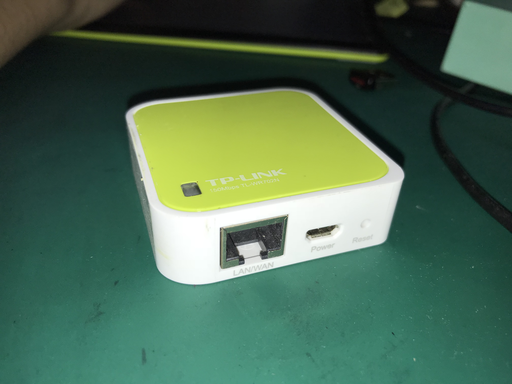

# 硬件设备说明

## 探针模组的构成

我们使用市面上现有的路由器改装而来，路由器型号为：TP-LINK TL-WR702N。

传输方式是使用HTTP协议的，`POST` `json`格式的数据进行数据传输，以下是收集到的真实数据展示：

```json
[
    {
        "client": "A0:D3:7A:66:90:59",
        "power": "-77",
        "connection": {
            "bssid": false,
            "essid": false
        },
        "history": [
            "AC-008\r"
        ]
    },
    {
        "client": "38:A4:ED:1D:B0:C0",
        "power": "-46",
        "connection": {
            "bssid": "24:69:68:D4:E8:44",
            "essid": "\u738b\u6210\u5927\u5e05\u6bd4"
        },
        "history": []
    },
    {
        "client": "78:02:F8:2B:2B:D3",
        "power": "-1",
        "connection": {
            "bssid": "5C:A8:6A:5B:34:54",
            "essid": "HUAWEI-A3ZJF3"
        },
        "history": []
    }
]
```

## 外观尺寸和图片



尺寸：5.5×5.8×1.8 cm

## 采集频段、数据传输默认频率

| 属性       | 数据                 |
| -------- | ------------------ |
| 采集频段     | 2.4G               |
| 数据传输默认频率 | 本地缓冲5s，随后每1s汇报一次缓冲 |

## 探针配置软件

基于DHCP和配置服务器实现的Zeroconf

## 调试工具

串口

