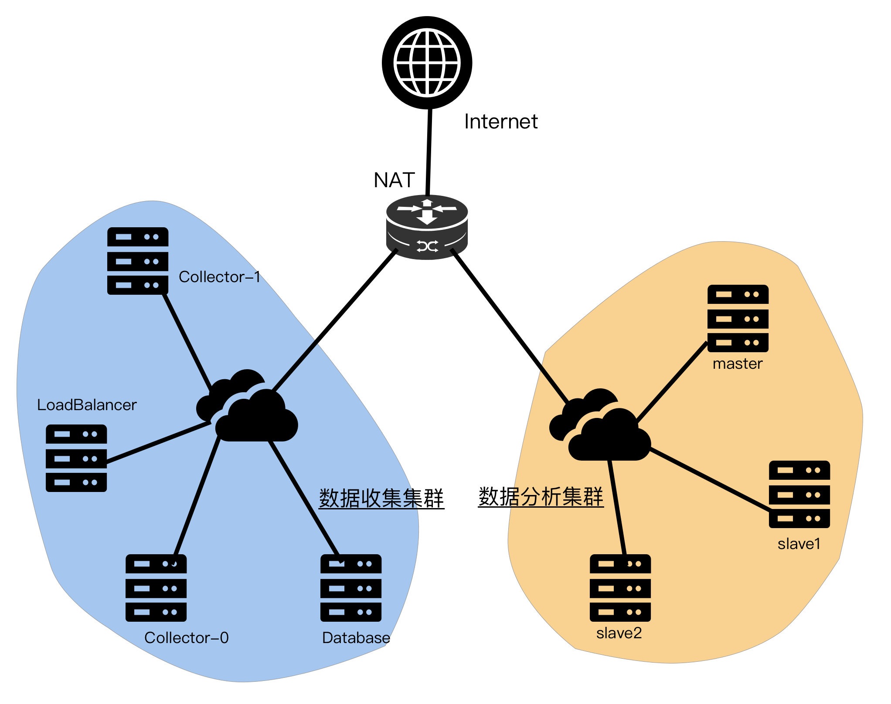

# 系统设计说明书

## 体系结构设计

### 整体结构图

### 网络拓扑设计

使用NAT将数据分析和收集集群限制在内网内，使用端口转发的方式开放数据收集集群的部分端口，用于探针数据的收集和展示数据的呈现。

### 软件架构设计

软件被分为三个子系统，数据收集系统、数据分析系统和数据展示系统，数据收集系统用于将Wifi探针的数据收集并按照一定格式存入数据库中，数据分析系统将收集系统存储的数据进行分析存入数据库，最后由数据展示系统将分析后的数据呈现给商户。

#### 数据收集系统架构设计

#### 数据分析系统架构设计

#### 数据分析系统架构设计

数据分析系统采用了hadoop+spark的结构，首先在三台服务器上构建hdfs分布式文件系统和yarn分布式计算框架，并以yarn为基础构建spark计算系统：

## 设计理念

## 数据分析算法

