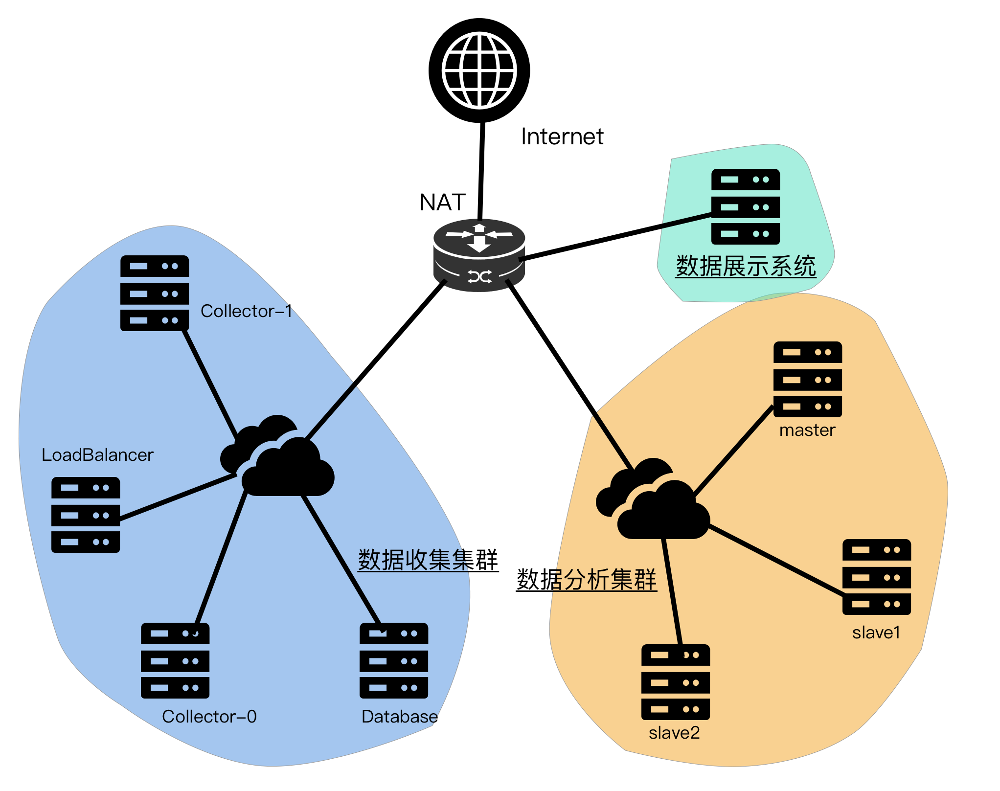
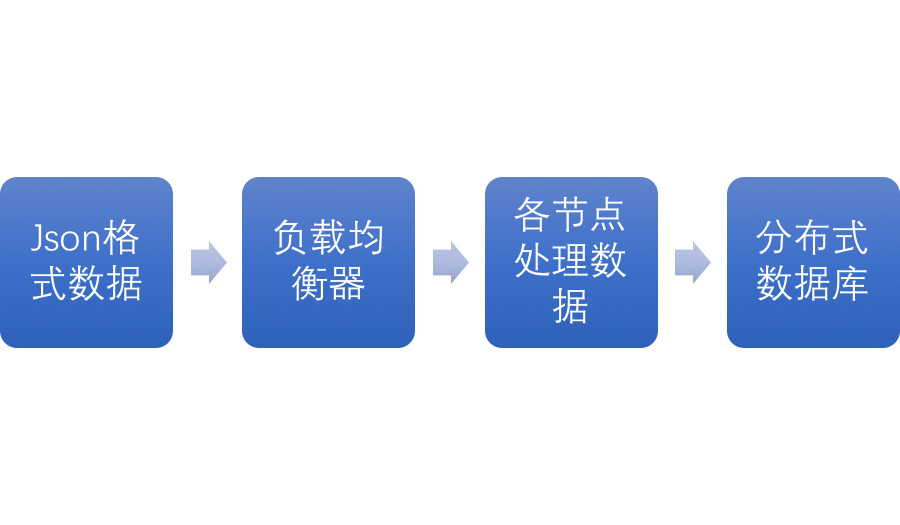
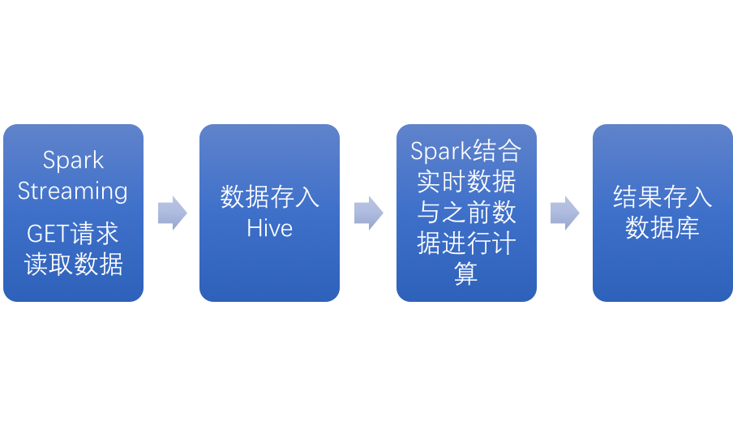

# 系统设计说明书

## 体系结构设计

### 整体结构图



### 网络拓扑设计

使用NAT将数据分析和收集集群限制在内网内，使用端口转发的方式开放数据收集集群的部分端口，用于探针数据的收集和展示数据的呈现。

### 软件架构设计

软件被分为三个子系统，数据收集系统、数据分析系统和数据展示系统，数据收集系统用于将Wifi探针的数据收集并按照一定格式存入数据库中，数据分析系统将收集系统存储的数据进行分析存入数据库，最后由数据展示系统将分析后的数据呈现给商户。

#### 数据收集系统架构设计

探针数据会被发送到负载均衡器节点，由其进行负载均衡，将任务分配到各个节点，然后进行简单处理存入分布式数据库



#### 数据分析系统架构设计

数据分析系统采用了hadoop+spark的结构，首先在三台服务器上构建hdfs分布式文件系统和yarn分布式计算框架，并以yarn为基础构建spark计算系统：



#### 数据展示系统架构设计

前端展示使用了灵活性较强的Web页面展示方法。
为了快速实现响应式的开发，Web展示页使用了基于Bootstrap的Lumino模板构建而成。
其中图表展示使用了百度的开源图标库Echarts 3.6.2和jQuery插件库easypiechart 2.1.5，使用的jQuery的版本为2.1.4。字体图标使用了Font Awesome 4.7.0。
前端页面由三个静态html页面构成，通过基于HTTP GET请求的API与展示后端进行数据通信，从而实现数据的实时刷新与展示。
后端服务器OS环境为Ubuntu Server 16.04，Web环境为Apache 2.4，API由PHP程序读取结果数据库，并以JSON的格式返回。PHP执行环境为PHP 7.0，程序使用轻量级的PHP数据库框架Medoo 1.1.3进行数据库访问

## 系统特色

1. 整个系统都部署在以openstack为基础的云计算平台上，使用虚拟化技术完整实现了分布式需求，并能实现热迁移功能。
2. 使用NAT协议将整个系统集群与外部网络隔离，增强安全性，同时各个子系统处于不同子网，便于修改和维护

## 算法设计

### 数据收集系统

### 数据分析系统

从数据收集系统获得的数据会被分为两个表存如分布式数据库Hive中：

```sql
CREATE TABLE client (
  `sniffer` STRING,
  `client` STRING,
  `power` INT,
  `time` INT
);
CREATE TABLE `power` (
  `sniffer` STRING,
  `client` STRING,
  `power` INT,
  `time` INT
);
```

其中client表存储三十秒内所有出现过的MAC地址，power表存储所有记录过的MAC地址。

然后依次按照以下顺序计算需求中的属性：

    连续时间：
    在power表中按mac分组进行检索，如果相邻两条时间在半小时内，则认为是连续时间，否则认为是用户离开后再次入店，然后从power中清除上一次离店时间之前的数据
    
    客流量：对client表计数
    
    入店量：上一数据中获取信号量小于某一阈值的计数，然后对client表删除这些小于阈值的行
    
    入店率：客流量/入店量
    
    来访周期：从client获取mac，然后按值从power中查找最后两个时间差，如果大于半个小时则记录，求平均输出
    
    新老顾客：
        新顾客，从client表中获取mac，按值查找在power表中最后两个时间差小于半个小时或只有一个记录的客户
        老顾客，获取client的计数，计数量减去新顾客
    
    驻店时长：client中获取mac，获取该值的连续时间，求平均输出
    
    跳出率：驻店时长小于120s的计数/client计数
    
    深访率：驻店时长大于1800s的计数/client计数
    
    顾客活跃度：
        高活跃的用户：来访周期小于36小时的用户的百分比
        中活跃度用户：非高活跃度中来访周期小于8天的用户百分比
        低活跃度用户：非中高用户中来访周期小于31天的用户百分比
        沉睡活跃度用户：1-上三项
