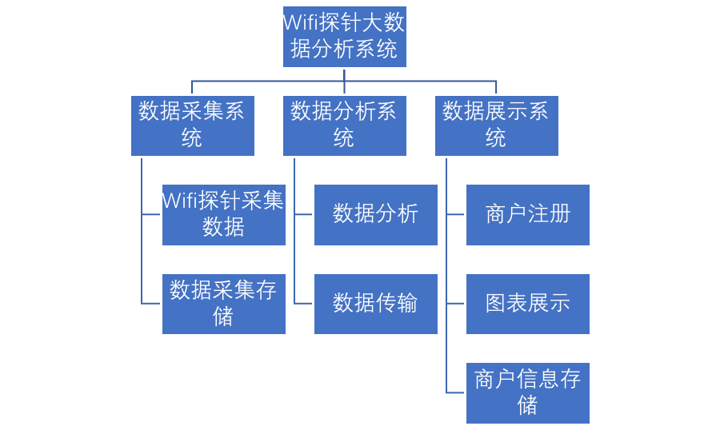
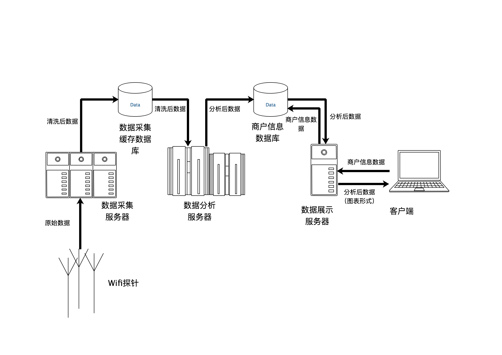

# 软件需求书-文档

## 引言

### 编写目的

编写本需求规格说明书目的是为了详细呈现基于Wifi探针的大数据分析系统的产品需求和系统的功能描述，为了进一步定制系统开发的细节问题，便于开发人员与客户的协调工作。本文面向的读者主要是系统使用客户，项目开发维护人员。

### 项目背景

WIfi探针能利用智能设备商WIFI模块所发出的无线广播信号进行感知，进而记录用户的访问行为和轨迹。

通过对采集MAC地址数据的分析与统计，可以把握门店的客流情况，精准监控客流质量，实时展示客流转化情况，从而帮助检测营销效果，发现潜在机会和改进措施，为便捷、高效精细化运营提供全方位数据参考。

### 术语于定义及编写说明

## 系统概述

### 产品描述

该系统利用探针数据的客流分析打破模式束缚，不仅仅只是提供可信的客流数据分析，同时还利用延伸的标杆管理才能，深刻洞悉并提供有助于推动实际客流量和消费者习惯行为的一系列因素。

首先探针设备能够采集客户唯一的定位标识，我们在这里采用了MAC地址，通过数据分析技术，采用离线计算和实时计算结合的方式，为商业环境提供科学的、全面的数据决策依据。

#### 一般性描述

本系统可细化为三个子系统：数据采集系统、数据分析系统和数据展示系统

数据采集系统的工作过程为：Wifi探针将采集到的数据发送到后端服务器中，进行简单的数据清洗后存储到数据库中

数据分析系统将实时地从数据采集系统的数据库中读取数据并存入其分析数据库中，进行实时数据分析，并将结果存入商户信息数据库

商户使用系统时先从数据展示系统进行注册，将对应Wifi探针与其账号进行绑定，然后展示系统便能实时从数据库抽取数据并以相关图标的形式展示给商户

#### 系统结构图

### 参考文献

## 需求描述

### 系统数据流图

### 外部接口

#### 用户界面

本系统使用网页图形界面，商户可以使用网页浏览器进行操作

#### 硬件接口

1. Wifi探针有线接口：Wifi探针使用标准以太网接口接入互联网，进行数据传输
2. Wifi探针无线接口：Wifi探针使用Wifi模块所发出的无线广播信号进行设备感知

#### 软件接口

1. 数据库接口：使用相关数据库连接API进行连接

#### 通信接口

1. Wifi探针与数据采集服务器的接口：Wifi探针使用HTTP协议POST发送json格式数据到服务器
2. 数据采集缓存数据库与数据分析服务器接口：数据分析服务器使用HTTP协议GET请求从数据库实时获取json格式的数据

### 功能性需求描述

#### 数据采集功能需求

1. Wifi探针能稳定实时获取附近设备的MAC地址、信号强度、正在连接Wifi、曾经连接过Wifi等信息
2. 探针每隔三秒发送一次数据
3. 能进行数据清洗，按照规范的格式存储获取的数据

#### 数据分析功能需求

1. 能实时获取数据并进行处理
2. 至少能计算以下九个指标：
- 客流量：店铺或区域整体客流及趋势
- 入店量：进入店铺或区域的客流及趋势
- 入店率：进⼊店铺或区域的客流占全部客流的比例及趋势
- 来访周期：进⼊店铺或区域的顾客距离上次来店的间隔
- 新老顾客：一定时间段内首次/两次以上进⼊店铺的顾客
- 顾客活跃度：按顾客距离上次来访间隔,划分为不同活跃度（高活跃度、中活跃度、低活跃度、沉睡活跃度）
- 驻店时长：进⼊店铺的顾客在店内的停留时长
- 跳出率：进⼊店铺后很快离店的顾客及占比(占总体客流)
- 深访率：进⼊店铺深度访问的顾客及占⽐(占总体客流）
4. 处理后数据按照规范格式存储
#### 数据展示功能需求

1. 提供友好的图表界面
2. 实现商户与Wifi探针的绑定
3. 图表能实时展示数据分析得出的九个指标

### 非功能性需求

#### 设计约束

1. 使用分布式的文件系统和计算系统
2. 多个商户能同时操作
3. 分析系统的操作系统必须基于Linux

#### 性能需求

1. 数据采集系统能实现超过1000个探针的信息同时采集
2. 数据分析系统能实现超过1000个探针的信息实时分析输出

#### 软件安全性

1. 通过网络将数据分析系统与外界隔离，保证其稳定运行
2. 商户间通过用户名和密码验证
3. 多机备份，减少信息丢失可能性

#### 软件可扩展性

1. 能很容易地添加新的分析指标和新的采集信息
2. 数据分析系统的构件能在不更改其他接口的情况下更换

